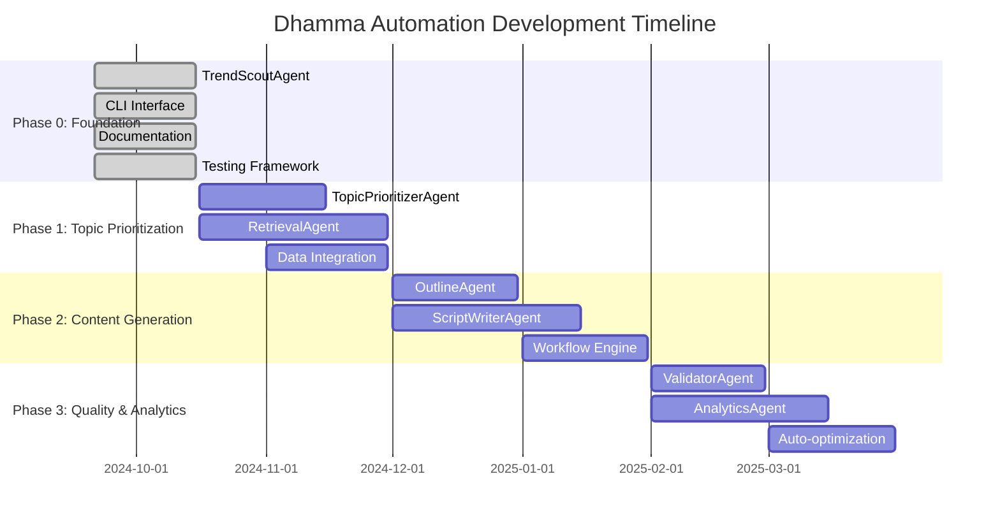

# 🗺️ แผนงานโครงการ (Roadmap)

> **📘 Blueprint (Single Source of Truth)**: สำหรับภาพรวมโครงการ ขอบเขต และกฎหลักที่ต้องไม่ละเมิด โปรดดู [/BLUEPRINT.md](/BLUEPRINT.md)

แผนการพัฒนาระบบ Dhamma Automation ตั้งแต่ Phase 0 ถึง Phase 3

## 🎯 วิสัยทัศน์โครงการ

**เป้าหมายสูงสุด**: สร้างระบบการผลิตคอนเทนต์ช่อง YouTube "ธรรมะดีดี" ที่ใช้ AI Automation ครอบคลุมตั้งแต่การวิเคราะห์เทรนด์ไปจนถึงการสร้างเนื้อหาสมบูรณ์

**KPI หลัก**:
- 📈 รายได้เป้าหมาย: 100,000 บาท/เดือน
- 🎬 ผลิตคอนเทนต์: 20-30 วิดีโอ/เดือน
- ⚡ ลดเวลาการผลิต: 70% โดยใช้ automation
- 📊 อัตราการมีส่วนร่วม: เพิ่มขึ้น 150%

## 📅 Timeline Overview



---

## 🌟 Phase 0: Foundation (เสร็จแล้ว ✅)

**ระยะเวลา**: กันยายน - ตุลาคม 2024

### ✅ สิ่งที่เสร็จแล้ว

#### TrendScoutAgent
- [x] BaseAgent abstract class พร้อม Generic types
- [x] TrendScoutAgent ที่จำลองการเรียก LLM
- [x] Pydantic models สำหรับ Input/Output
- [x] อัลกอริทึมการคำนวณคะแนนแบบ deterministic
- [x] การสร้างหัวข้อจากคำสำคัญ

#### CLI Interface
- [x] Typer-based CLI พร้อม Rich output
- [x] คำสั่ง `trend-scout` พร้อม parameters
- [x] แสดงผลตารางสวยงาม
- [x] Progress indicators และ error handling

#### Infrastructure
- [x] โครงสร้างโฟลเดอร์ตามมาตรฐาน
- [x] pyproject.toml พร้อม dependencies
- [x] Prompt loading system
- [x] Configuration management (Pydantic Settings)
- [x] Logging system (Rich + file)

#### Documentation
- [x] เอกสารภาษาไทยครบครัน
- [x] MkDocs setup พร้อม Material theme
- [x] สถาปัตยกรรมระบบ
- [x] คู่มือการเพิ่ม Agent ใหม่

#### Testing
- [x] Unit tests สำหรับ TrendScoutAgent
- [x] Tests สำหรับ prompt loading
- [x] Tests สำหรับ scoring utilities
- [x] CI/CD workflow (GitHub Actions)

### 📊 ผลลัพธ์ Phase 0

**Deliverables**:
- ✅ TrendScoutAgent ที่ใช้งานได้
- ✅ CLI interface สำหรับทดสอบ
- ✅ เอกสารครบครัน 15+ หน้า
- ✅ Test coverage > 85%
- ✅ CI/CD pipeline พร้อมใช้งาน

**ตัวอย่างการใช้งาน**:
```bash
python -m cli.main trend-scout \
  --input src/agents/trend_scout/mock_input.json \
  --out output/result.json
```

---

## 🎯 Phase 1: Topic Prioritization & Data Integration

**ระยะเวลา**: ตุลาคม - พฤศจิกายน 2024

### 🚧 งานที่กำลังพัฒนา

#### 1. TopicPrioritizerAgent
**เป้าหมาย**: จัดลำดับความสำคัญของหัวข้อจาก TrendScout

**Features**:
- [ ] รับ input จาก TrendScoutAgent
- [ ] ประเมินตามเกณฑ์ธุรกิจ (ROI, Risk, Brand fit)
- [ ] จัดลำดับความสำคัญพร้อมเหตุผล
- [ ] สร้างคำแนะนำการผลิต

**Input**:
```json
{
  "topics": [...],              // จาก TrendScout
  "business_goals": {...},      // เป้าหมายธุรกิจ
  "resource_constraints": {...} // ข้อจำกัดทรัพยากร
}
```

**Output**:
```json
{
  "prioritized_topics": [...],  // หัวข้อที่จัดลำดับแล้ว
  "production_schedule": {...}, // แผนการผลิต
  "resource_allocation": {...}  // การจัดสรรทรัพยากร
}
```

#### 2. RetrievalAgent
**เป้าหมาย**: ค้นหาและรวบรวมข้อมูลสำหรับการสร้างเนื้อหา

**Data Sources**:
- [ ] YouTube Data API (วิดีโอที่เกี่ยวข้อง)
- [ ] Google Trends (ข้อมูลเทรนด์)
- [ ] Buddhist scriptures database
- [ ] Competitor analysis
- [ ] Social media mentions

**Features**:
- [ ] Multi-source data gathering
- [ ] Content relevance scoring
- [ ] Data quality validation
- [ ] Caching mechanism

#### 3. Data Integration Layer
**เป้าหมาย**: รวมข้อมูลจากแหล่งต่างๆ ให้เป็นระบบ

**Components**:
- [ ] API connectors (YouTube, Google Trends)
- [ ] Data normalization
- [ ] Rate limiting และ quota management
- [ ] Error handling และ retry logic

### 📈 Success Metrics Phase 1

- **Accuracy**: ความถูกต้องของการจัดลำดับ > 80%
- **Data Quality**: ข้อมูลที่รวบรวมได้มีคุณภาพ > 85%
- **Performance**: Response time < 30 วินาที
- **Coverage**: ครอบคลุมข้อมูล 5+ sources

---

## 🎬 Phase 2: Content Generation

**ระยะเวลา**: ธันวาคม 2024 - มกราคม 2025

### 🎨 OutlineAgent

**เป้าหมาย**: สร้างโครงเรื่องที่มีโครงสร้างชัดเจน

**Features**:
- [ ] วิเคราะห์หัวข้อและสร้างโครงเรื่อง
- [ ] กำหนด hook, main points, และ conclusion
- [ ] คำนวณเวลาแต่ละส่วน
- [ ] เสนอ visual elements และ examples

**Template Structure**:
```
1. Hook (0-30 วิ) - ดึงดูดใจผู้ชม
2. Problem (30-90 วิ) - นำเสนอปัญหา
3. Solution (90-80% ของวิดีโอ) - แนวทางแก้ไข
4. Call to Action (สุดท้าย 30 วิ) - เรียกร้องปฏิบัติ
```

### ✍️ ScriptWriterAgent

**เป้าหมาย**: เขียนสคริปต์วิดีโอที่พร้อมใช้งาน

**Features**:
- [ ] แปลงโครงเรื่องเป็นสคริปต์เต็ม
- [ ] ปรับน้ำเสียงตามผู้ชมเป้าหมาย
- [ ] เพิ่ม visual cues และ timing
- [ ] ตรวจสอบ brand compliance

**Output Format**:
```
[00:00-00:30] HOOK
วอยซ์โอเวอร์: "คุณเคยรู้สึกเครียดจนนอนไม่หลับไหม?"
Visual: ภาพคนนอนไม่หลับ, กลับตัวบนเตียง

[00:30-01:00] PROBLEM
วอยซ์โอเวอร์: "วันนี้เราจะมาดูวิธีปล่อยวางให้ใจสงบ..."
Visual: ตัวอย่างปัญหาในชีวิตประจำวัน
```

### ⚙️ Workflow Engine

**เป้าหมาย**: จัดการ workflow การผลิตแบบอัตโนมัติ

**Features**:
- [ ] Chain agents ตามลำดับ
- [ ] Parallel processing สำหรับ multiple topics
- [ ] Error handling และ retry logic
- [ ] Progress tracking และ notifications

**Workflow Example**:
```
TrendScout → TopicPrioritizer → Retrieval → Outline → ScriptWriter → Validator
```

### 📋 Success Metrics Phase 2

- **Content Quality**: การให้คะแนนโดย human reviewer > 4/5
- **Production Speed**: ลดเวลาการผลิต 60%
- **Script Completeness**: สคริปต์ที่ใช้งานได้ทันที > 90%
- **Brand Consistency**: ความสอดคล้องกับแบรนด์ > 95%

---

## 📊 Phase 3: Quality Assurance & Analytics

**ระยะเวลา**: กุมภาพันธ์ - มีนาคม 2025

### ✅ ValidatorAgent

**เป้าหมาย**: ตรวจสอบคุณภาพเนื้อหาก่อนเผยแพร่

**Quality Checks**:
- [ ] Brand compliance validation
- [ ] Factual accuracy checking
- [ ] Sentiment analysis
- [ ] SEO optimization validation
- [ ] Accessibility compliance

**Validation Categories**:
```
1. Content Quality (40%)
   - ความถูกต้องของข้อมูล
   - ความชัดเจนของการนำเสนอ
   - ความเข้ากับกลุ่มเป้าหมาย

2. Brand Compliance (30%)
   - ความสอดคล้องกับ brand voice
   - การใช้ภาษาที่เหมาะสม
   - ความเป็นบวกของเนื้อหา

3. Technical Quality (30%)
   - SEO optimization
   - Video structure
   - Call-to-action effectiveness
```

### 📈 AnalyticsAgent

**เป้าหมาย**: วิเคราะห์ประสิทธิภาพและปรับปรุงระบบ

**Analytics Features**:
- [ ] Performance tracking (views, engagement, revenue)
- [ ] Content effectiveness analysis
- [ ] Trend prediction และ forecasting
- [ ] ROI calculation
- [ ] A/B testing results

**Reports Generated**:
```
1. Weekly Performance Report
   - Top performing topics
   - Engagement metrics
   - Revenue attribution

2. Monthly Optimization Report
   - Content gaps analysis
   - Trending topics forecast
   - Production efficiency metrics

3. Quarterly Strategic Report
   - Market position analysis
   - Growth opportunities
   - Technology roadmap
```

### 🤖 Auto-optimization Engine

**เป้าหมาย**: ปรับปรุงระบบอัตโนมัติตามผลการวิเคราะห์

**Optimization Areas**:
- [ ] Prompt engineering optimization
- [ ] Agent parameter tuning
- [ ] Content strategy adjustment
- [ ] Production schedule optimization

### 🎯 Success Metrics Phase 3

- **Content Success Rate**: วิดีโอที่ได้ผลตามคาด > 75%
- **Revenue Growth**: เพิ่มขึ้น 40% จากช่วงก่อน automation
- **Quality Score**: คะแนนคุณภาพเฉลี่ย > 4.2/5
- **Automation Rate**: งานที่ automate ได้ > 80%

---

## 🔮 Phase 4+: Advanced Features (Future Vision)

### 🌐 Multi-Platform Expansion
- Facebook, Instagram, TikTok content adaptation
- Platform-specific optimization
- Cross-platform analytics

### 🎥 Video Production Automation
- AI video editing integration
- Automated thumbnail generation
- Voice synthesis และ dubbing

### 🧠 Advanced AI Integration
- GPT-4+ integration
- Custom model fine-tuning
- Real-time content personalization

### 🌍 Internationalization
- Multi-language support
- Cultural adaptation
- Global market expansion

---

## ⚡ Critical Success Factors

### 1. **Technology Excellence**
- Robust architecture design
- Scalable infrastructure
- High-quality AI integration

### 2. **Content Quality**
- Maintaining human-like creativity
- Brand consistency
- Audience engagement

### 3. **Business Alignment**
- Clear ROI measurement
- Strategic goal alignment
- Stakeholder buy-in

### 4. **Continuous Improvement**
- Data-driven optimization
- Regular performance review
- Agile development approach

## 📞 Get Involved

สนใจมีส่วนร่วมในการพัฒนา? 

- 📧 **Email**: [โปรดติดต่อผ่าน GitHub Issues]
- 💻 **Contribute**: [Agent Development Guide](AGENT_LIFECYCLE.md)
- 📚 **Documentation**: [Architecture Overview](ARCHITECTURE.md)
- 🐛 **Bug Reports**: [GitHub Issues](https://github.com/natbkgift/dhamma-channel-automation/issues)

---

🙏 **วิสัยทัศน์**: สร้างระบบ AI ที่ช่วยเผยแพร่ธรรมะให้คนไทยได้เข้าถึงง่ายขึ้น พร้อมสร้างรายได้ที่ยั่งยืนให้ผู้ผลิตเนื้อหา