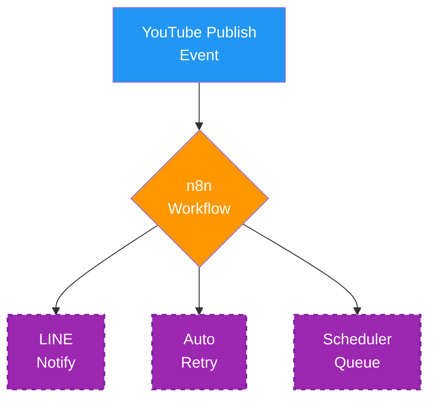
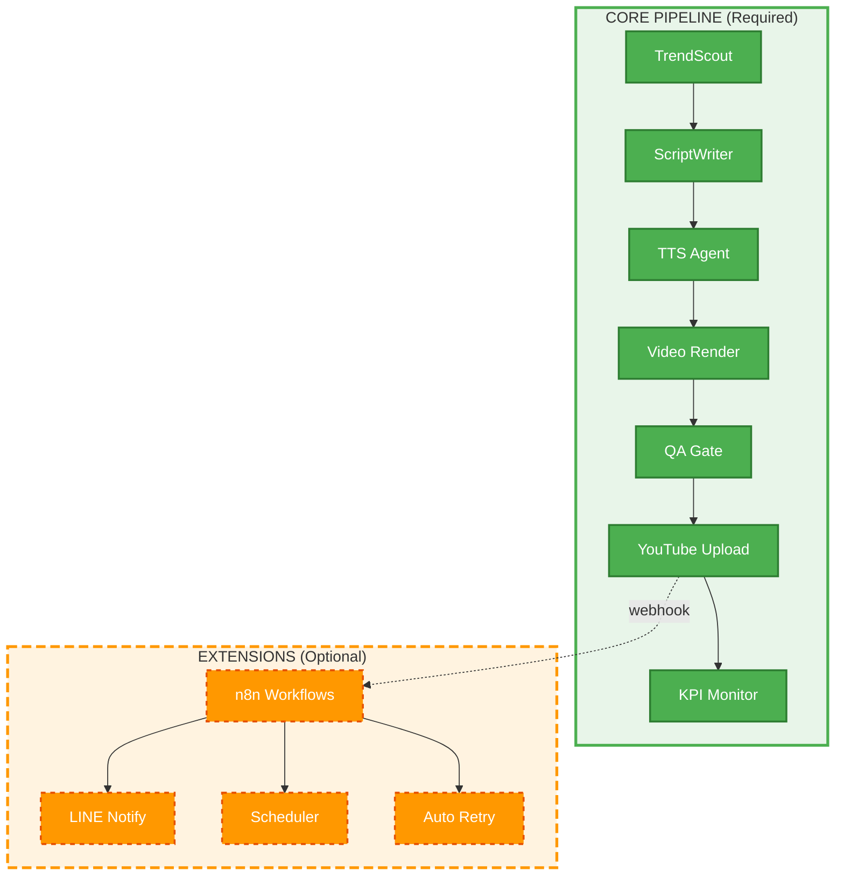

# ROADMAP — Dhamma Channel Automation

> **📘 Blueprint (Single Source of Truth)**: สำหรับภาพรวมโครงการ ขอบเขต และกฎหลักที่ต้องไม่ละเมิด โปรดดู [/BLUEPRINT.md](/BLUEPRINT.md)

เอกสารนี้แสดงแผนงานพัฒนาระบบ Dhamma Channel Automation แบบ **PR-based development** โดยแบ่งเป็น Core Track (PR1–PR11), Extension Track (PR-2.2–PR-2.4) และ Future Vision (PR12+)

## 🎯 วิสัยทัศน์โครงการ

**เป้าหมายสูงสุด**: สร้างระบบการผลิตคอนเทนต์ช่อง YouTube "ธรรมะดีดี" ที่ใช้ AI Automation ครอบคลุมตั้งแต่การวิเคราะห์เทรนด์ไปจนถึงการสร้างเนื้อหาสมบูรณ์

**KPI หลัก**:
- 📈 รายได้เป้าหมาย: 100,000 บาท/เดือน
- 🎬 ผลิตคอนเทนต์: 20-30 วิดีโอ/เดือน
- ⚡ ลดเวลาการผลิต: 70% โดยใช้ automation
- 📊 อัตราการมีส่วนร่วม: เพิ่มขึ้น 150%

---

## 🏗️ หลักการออกแบบ (Design Principles)

ระบบ Dhamma Channel Automation ออกแบบตามหลักการสำคัญดังนี้:

### 1. **Core System ทำงานได้โดยไม่ต้องพึ่ง Extension**
- Pipeline หลัก (orchestrator) ทำงานได้เต็มรูปแบบโดยไม่ต้องมี n8n, LINE notify หรือ extension อื่นๆ
- Extension เป็นเพียงส่วนเสริม (optional) ที่เพิ่มความสะดวก แต่ไม่ใช่ dependency

### 2. **มี Kill Switch และ Guardrails**
- `PIPELINE_ENABLED=false` หยุดการทำงานของ pipeline อย่างปลอดภัย
- Orchestrator และ web runner บังคับใช้ kill switch
- Human oversight gates ในทุกขั้นตอนสำคัญ

### 3. **ตรวจสอบย้อนหลังได้ (Auditable)**
- ทุก pipeline run สร้าง output directories พร้อม timestamp
- Logs, artifacts และ metadata ครบถ้วน
- สามารถตรวจสอบการตัดสินใจของ AI ได้ทุกขั้นตอน

### 4. **Automation เพิ่มแบบไม่ผูกระบบ (Loosely Coupled)**
- แต่ละ agent ทำงานแบบ pure function (อ่าน input, เขียน output)
- Event-driven extensions (n8n) ถอดออกได้โดยไม่กระทบ core
- Single-channel focus (ไม่มี multi-tenant complexity)

---

## 🚀 CORE TRACK (PR1–PR11)

แกนหลักของระบบ (Core Pipeline) ที่ทำงานแบบ deterministic และต้องทำงานได้โดยไม่พึ่ง extension

### **PR1: Baseline Snapshot + Global Kill Switch** ✅
สร้าง baseline reference artifacts และเพิ่ม kill switch `PIPELINE_ENABLED=false` เพื่อความปลอดภัย ทำให้สามารถหยุด pipeline ได้ทันทีโดยไม่ต้องแก้โค้ด

### **PR2: FlowBiz Client Product Adoption** ✅
ปรับระบบให้เป็น FlowBiz Client Product รูปแบบ single-channel พร้อม contract endpoints (`/healthz`, `/v1/meta`), localhost-only binding (port 3007), และ System Nginx pattern

### **PR3: Repository Cleanup + Runtime Safety**
ทำความสะอาด repository โดยลบไฟล์ชั่วคราว, artifacts ที่ไม่ใช้, และเพิ่ม runtime safety checks เพื่อป้องกันการทำงานที่ผิดพลาด

### **PR4: Voiceover Generation (TTS Auto)**
เพิ่ม TTS agent สำหรับสังเคราะห์เสียงพากย์อัตโนมัติ รองรับ Google Cloud TTS, Azure TTS หรือ local models พร้อม voice quality validation

### **PR5: Video Rendering (FFmpeg Auto)**
สร้าง video rendering pipeline ด้วย FFmpeg โดยรวม audio, visuals, subtitles เข้าด้วยกัน รองรับ templates หลายรูปแบบ

### **PR6: Quality Gate + Auto Decision**
เพิ่ม quality gate ที่ตรวจสอบ content quality, compliance, SEO readiness พร้อมระบบตัดสินใจอัตโนมัติว่า content ผ่านเกณฑ์หรือต้อง review โดยมนุษย์

### **PR7: YouTube Auto Upload + Retry Logic**
สร้าง YouTube upload agent พร้อม idempotent upload (ตรวจจับวิดีโอซ้ำ), retry logic สำหรับ transient failures, และ metadata optimization

### **PR8: Content Plan Calendar (Scheduler / Queue)**
เพิ่มระบบจัดการตารางเนื้อหา (content calendar) พร้อม queue management, scheduling logic, และ priority handling

### **PR9: Asset Library**
สร้าง asset library สำหรับจัดการ visuals, music, sound effects, templates พร้อมระบบ tagging และ search

### **PR10: Short/Long Templates + Post Content Automation**
เพิ่ม templates สำหรับวิดีโอแบบ short-form และ long-form พร้อมระบบ post-content automation (คำบรรยาย, community posts, etc.)

### **PR11: KPI Monitor & Recommendation Engine (Read-Only)**
สร้าง KPI monitoring dashboard และ recommendation engine ที่**อ่านข้อมูลอย่างเดียว** โดยไม่เปลี่ยนแปลง prompts หรือ agent parameters (มนุษย์เป็นผู้ตัดสินใจ)

---

## 🔌 EXTENSION TRACK (Optional)

ส่วนเสริมที่**ถอดออกได้**โดยไม่กระทบการทำงานของ Core Pipeline

### การันตี: Core ยังทำงานได้เต็มรูปแบบโดยไม่มี Extensions
- การปิดหรือลบ n8n workflows ไม่ทำให้ core pipeline พัง
- Extensions เป็น event-driven และทำงานแบบ async
- มีไว้เพื่อความสะดวก ไม่ใช่ dependency

### **PR-2.2: n8n Integration**
เพิ่ม n8n workflows สำหรับ event-driven orchestration:
- กำหนดเวลารัน pipeline อัตโนมัติ (cron scheduling)
- เชื่อมต่อกับ external services (webhooks, APIs)
- Trigger pipeline runs จาก external events

### **PR-2.3: LINE Notify หลัง Publish**
ส่ง LINE notifications เมื่อ:
- วิดีโอ publish สำเร็จบน YouTube
- Pipeline run เสร็จสมบูรณ์
- เกิด error ที่ต้องการความสนใจ

### **PR-2.4: Auto Retry + Fail Alert**
เพิ่ม intelligent retry logic:
- Exponential backoff สำหรับ transient failures
- Alert routing เมื่อ retry หมด
- Human intervention triggers

---

## 🔮 FUTURE (PR12+)

คุณสมบัติขั้นสูงที่อยู่นอกเหนือ Core Track (พิจารณาหลัง PR11)

### Closed-Loop Optimization (แบบมีข้อจำกัด)
- **AI อ่าน KPIs**: ระบบวิเคราะห์ performance metrics อัตโนมัติ
- **AI แนะนำการปรับเล็กน้อย**: เช่น hook wording, video length, posting time
- **Human Override ทุกครั้ง**: มนุษย์ต้องอนุมัติก่อนทุกการเปลี่ยนแปลง
- **Rule + Confidence Threshold**: มีกฎและเกณฑ์ความเชื่อมั่นที่ชัดเจน

### ข้อจำกัดสำคัญ (Non-Negotiable)
- ❌ AI **ห้าม**เปลี่ยน prompts, agent parameters หรือกลยุทธ์เนื้อหาเอง
- ❌ AI **ห้าม**ตัดสินใจลงทุนหรือเปลี่ยนแปลงสำคัญโดยไม่มีมนุษย์
- ✅ AI **ได้**เสนอแนะและแสดง reasoning
- ✅ มนุษย์**ต้อง**เป็นผู้ตัดสินใจขั้นสุดท้าย

### Multi-Channel Support (ไกลกว่า Client Product Mode)
- รองรับหลายช่อง (multi-tenant)
- แยก data, configs, และ KPIs ตามช่อง
- Shared infrastructure แต่ isolated workspaces

### Advanced Features
- **Platform Expansion**: Facebook, TikTok, Instagram optimization
- **Advanced AI**: GPT-4+, fine-tuned models, real-time personalization
- **Internationalization**: Multi-language support, cultural adaptation

---

## 📊 สรุปภาพรวม

### แยกชัด Core vs Extension

**CORE (PR1–PR11):**
- ✅ ทำงานได้เต็มรูปแบบโดยไม่ต้องพึ่ง extension
- ✅ Deterministic และ reproducible
- ✅ Orchestrator-managed, sequential execution
- ✅ มี kill switch และ guardrails ครบครัน
- ✅ Audit trail และ logging ครบถ้วน

**EXTENSION (PR-2.2–PR-2.4):**
- ⚡ Event-driven และ async
- ⚡ n8n-managed workflows
- ⚡ **ถอดออกได้โดยไม่กระทบ core**
- ⚡ เพิ่มความสะดวกและ automation เพิ่มเติม

### เหมาะกับการ Scale ช่องในอนาคต

ระบบออกแบบให้:
1. **เริ่มต้นง่าย**: Single-channel, client product mode
2. **ขยายได้**: Extension track เพิ่มได้ตามต้องการ
3. **ยืดหยุ่น**: Future track พร้อมรองรับ multi-channel
4. **ปลอดภัย**: Human oversight gates ในทุกขั้นตอนสำคัญ

---

## 🎨 แผนภาพ Pipeline (Mermaid Diagram)

### Core Pipeline Flow

### Extensions (Optional, Event-Driven)

### ความสัมพันธ์ระหว่าง Core และ Extension

**หมายเหตุ:**
- 🟢 สีเขียว = CORE (จำเป็น, deterministic)
- 🟠 สีส้ม = EXTENSION (เสริม, ถอดออกได้)
- เส้นประ `-.->` = event/webhook (optional connection)
- เส้นทึบ `-->` = sequential flow (required)

---

## ⚡ Critical Success Factors

### 1. **Technology Excellence**
- Robust architecture design
- Scalable infrastructure
- High-quality AI integration
- Comprehensive testing และ validation

### 2. **Content Quality**
- Maintaining human-like creativity
- Brand consistency
- Audience engagement
- Buddhist doctrine accuracy

### 3. **Business Alignment**
- Clear ROI measurement
- Strategic goal alignment
- Stakeholder buy-in
- Sustainable revenue model

### 4. **Continuous Improvement**
- Data-driven optimization
- Regular performance review
- Agile development approach
- Community feedback loop

### 5. **Operational Safety**
- Kill switch enforcement
- Human oversight gates
- Audit trails
- Compliance monitoring

---

## 📞 การมีส่วนร่วม

สนใจมีส่วนร่วมในการพัฒนา?

- 📧 **Email**: [โปรดติดต่อผ่าน GitHub Issues]
- 💻 **Contribute**: [Agent Development Guide](AGENT_LIFECYCLE.md)
- 📚 **Documentation**: [Architecture Overview](ARCHITECTURE.md)
- 🐛 **Bug Reports**: [GitHub Issues](https://github.com/natbkgift/dhamma-channel-automation/issues)
- 📋 **Project Contract**: [FlowBiz Integration](PROJECT_CONTRACT.md)
- 🛡️ **Safety Guidelines**: [Operational Safety](OPS_SAFETY.md)

---

🙏 **วิสัยทัศน์**: สร้างระบบ AI ที่ช่วยเผยแพร่ธรรมะให้คนไทยได้เข้าถึงง่ายขึ้น พร้อมสร้างรายได้ที่ยั่งยืนให้ผู้ผลิตเนื้อหา โดยยึดหลักความปลอดภัย การตรวจสอบได้ และการดูแลโดยมนุษย์เป็นหลัก